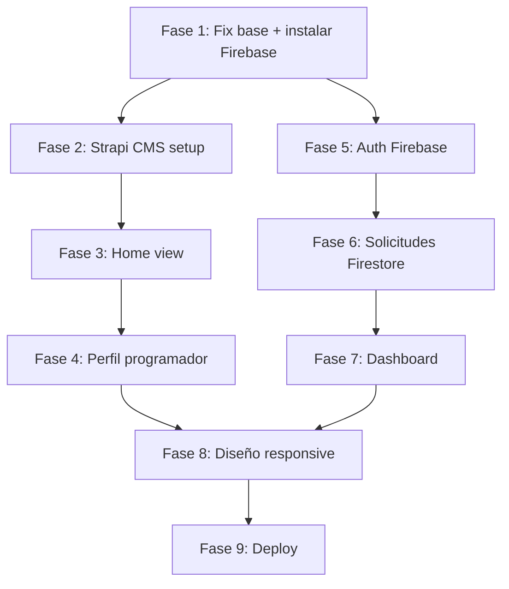

# Plan de Implementación — Portafolio Web Integrador

## Descripción del Proyecto

Portafolio web desarrollado en **Angular 21** que consume contenido dinámico desde **Strapi CMS** (headless), usa **Firebase Authentication** para login/registro, **Cloud Firestore** para gestión de solicitudes de contacto, y se despliega en **Firebase Hosting**.

---

## Arquitectura General

```
Cliente Angular 21 (SSR)
   ├── GET contenido dinámico → Strapi CMS REST API (programadores, proyectos, servicios, tecnologías)
   ├── Auth → Firebase Authentication (email/password + Google opcional)
   ├── CRUD solicitudes → Cloud Firestore
   └── Archivos/imágenes → Firebase Storage (si se usa)
```

---

## Estado Actual del Proyecto

- ✅ Angular 21 inicializado con SSR
- ✅ TailwindCSS v4 instalado
- ✅ Estructura de rutas en `app.routes.ts` definida
- ✅ Vista `home` creada (vacía)
- ❌ **Firebase NO instalado** — no está en `package.json`
- ❌ **AngularFire NO instalado**
- ❌ Vistas `profile`, `auth`, `dashboard` — **no existen aún**
- ❌ Servicios, guards, modelos — **no existen**
- ❌ Strapi NO configurado aún

> [!IMPORTANT]
> El usuario revirtió el fix de `app.routes.ts` al estado anterior (importando `home.component` que no existe). Esto causará errores de compilación. Se debe corregir esto en la **Fase 1**.

---

## Open Questions

> [!IMPORTANT]
> **¿Ya tienes un proyecto Strapi creado?** El CMS puede correrse localmente (`localhost:1337`) o en Strapi Cloud. Necesitamos saber:
> - ¿Tienes Strapi instalado/configurado?
> - ¿Cuál será la URL base de Strapi API que usará Angular?

> [!IMPORTANT]
> **¿Ya tienes un proyecto Firebase creado?** Necesitamos las credenciales (`firebaseConfig`) del proyecto para configurar `environment.ts`.

> [!IMPORTANT]
> **¿Cuántos programadores hay en el portafolio?** El MD menciona "la pareja" — son 2 programadores. ¿Tienen nombres/datos definidos?

> [!NOTE]
> El proyecto usa el naming nuevo de Angular 21 (`home.ts`, clase `Home`) pero las rutas aún referencian `home.component`. Se corregirá en Fase 1.

---

## Fases de Implementación

---

### FASE 1 — Corrección de Base y Setup de Dependencias

**Objetivo:** Tener el proyecto compilando sin errores y con todas las dependencias necesarias instaladas.

#### [MODIFY] [app.routes.ts](file:///c:/Users/MSI/Desktop/PPW/ProyectoIntegrador/portafolio-web/src/app/app.routes.ts)
- Corregir imports para que usen el naming correcto de Angular 21
- Usar lazy loading para cada vista (mejor rendimiento y SSR)

#### Instalar dependencias faltantes
```bash
pnpm add firebase @angular/fire
```

#### [NEW] `src/environments/environment.ts` y `environment.production.ts`
- Variables de configuración: Firebase config, Strapi API URL

#### [NEW] `src/app/core/` — Carpeta de servicios core
- `src/app/core/services/` — servicios globales
- `src/app/core/guards/` — guards de rutas
- `src/app/core/models/` — interfaces TypeScript

#### [MODIFY] [app.config.ts](file:///c:/Users/MSI/Desktop/PPW/ProyectoIntegrador/portafolio-web/src/app/app.config.ts)
- Registrar `provideFirebaseApp`, `provideAuth`, `provideFirestore`
- Registrar `HttpClient` para consumo de Strapi

---

### FASE 2 — Configuración de Strapi CMS

**Objetivo:** Tener Strapi funcionando con los Content Types requeridos y la API accesible desde Angular.

#### Content Types a crear en Strapi (mínimo requerido):

| Content Type | Campos sugeridos |
|---|---|
| **Programador** | nombre, apellido, email, foto, bio, especialidad, tecnologías (relación), proyectos (relación) |
| **Proyecto** | nombre, descripción, imagen, url, destacado (boolean), tecnologías (relación), programadores (relación) |
| **Servicio** | nombre, descripción, icono |
| **Tecnología** | nombre, logo, categoría |
| **Home** | titulo_hero, subtitulo_hero, descripcion_empresa, imagen_hero |

#### [NEW] `src/app/core/services/strapi.service.ts`
- Servicio genérico con `HttpClient` para consumir la API de Strapi
- Métodos: `getProgramadores()`, `getProgramadorById(id)`, `getProyectos()`, `getProyectosDestacados()`, `getServicios()`, `getHome()`

#### [NEW] `src/app/core/models/strapi.models.ts`
- Interfaces TypeScript para todos los tipos: `Programador`, `Proyecto`, `Servicio`, `Tecnologia`, `HomeContent`

---

### FASE 3 — Vista Home

**Objetivo:** Página principal consumiendo datos reales de Strapi.

#### [MODIFY] [home.ts](file:///c:/Users/MSI/Desktop/PPW/ProyectoIntegrador/portafolio-web/src/app/views/home/home.ts)
Secciones requeridas (todas con datos desde Strapi):
1. **Hero** — título, subtítulo, descripción de la empresa, imagen
2. **Cards de Programadores** — foto, nombre, especialidad → navega a `/programador/:id`
3. **Servicios** — listado/grid de servicios con iconos
4. **Proyectos Destacados** — solo los que tienen `destacado: true` en Strapi
5. **Sección de Contacto** — botón "Enviar Solicitud" (requiere auth)

#### [NEW] Componentes reutilizables en `src/app/components/`
- `programmer-card/` — card de programador
- `project-card/` — card de proyecto
- `service-card/` — card de servicio
- `navbar/` — navegación con links a Home, Login, Solicitudes
- `footer/` — pie de página

---

### FASE 4 — Vista Perfil del Programador

**Objetivo:** Página individual de cada programador con sus proyectos.

#### [NEW] `src/app/views/profile/` (crear vista completa)
- Recibe `:id` por parámetro de ruta
- Muestra información completa del programador desde Strapi
- Lista **todos los proyectos relacionados** al programador (incluyendo proyectos compartidos con el otro programador)
- Botón para enviar solicitud al programador (requiere auth)

---

### FASE 5 — Autenticación Firebase

**Objetivo:** Login y registro funcional con Firebase Auth.

#### [NEW] `src/app/views/auth/` (crear vista completa)
- Formulario de **registro** (solo usuarios externos): email + contraseña
- Formulario de **login**: email + contraseña
- *(Opcional extra)* Login con Google
- Redirección post-login a la página previa o a Home

#### [NEW] `src/app/core/services/auth.service.ts`
- `register(email, password)` → crea usuario en Firebase Auth
- `login(email, password)` → inicia sesión
- `loginWithGoogle()` → OAuth Google (opcional)
- `logout()` → cierra sesión
- `getCurrentUser()` → observable del usuario actual
- `isLoggedIn()` → observable boolean

#### [NEW] `src/app/core/guards/auth.guard.ts`
- Protege rutas que requieren autenticación (`/solicitudes`)
- Redirige a `/login` si no hay usuario autenticado

#### [MODIFY] [app.routes.ts](file:///c:/Users/MSI/Desktop/PPW/ProyectoIntegrador/portafolio-web/src/app/app.routes.ts)
- Agregar `canActivate: [authGuard]` a la ruta `/solicitudes`

> [!NOTE]
> Los programadores son registrados en Firebase Auth manualmente (no desde la app). Su perfil de contenido vive en Strapi. La diferencia de roles se puede detectar comparando el email del usuario autenticado con los emails de programadores en Strapi.

---

### FASE 6 — Solicitudes de Contacto (Firestore)

**Objetivo:** Formulario y almacenamiento de solicitudes en Cloud Firestore.

#### Estructura del documento en Firestore:
```
/solicitudes/{solicitudId}
   ├── uid: string           (uid del usuario autenticado)
   ├── correoUsuario: string
   ├── nombreSolicitante: string
   ├── correoSolicitante: string  
   ├── descripcionProyecto: string
   ├── programadorId: string  (id del programador en Strapi)
   ├── programadorNombre: string
   ├── fechaCreacion: Timestamp
   └── estado: 'Pendiente' | 'Respondida'
```

#### [NEW] `src/app/core/services/solicitudes.service.ts`
- `crearSolicitud(data)` → guarda en Firestore
- `getSolicitudesDeUsuario(uid)` → solicitudes enviadas por el usuario
- `getSolicitudesDeProgramador(programadorId)` → solicitudes recibidas por el programador
- `actualizarEstado(id, estado, observacion)` → solo para programadores

#### [NEW] Componente modal/formulario de solicitud
- `src/app/components/contact-form/` — formulario reutilizable

---

### FASE 7 — Dashboard de Solicitudes

**Objetivo:** Vista diferenciada según tipo de usuario (externo vs programador).

#### [NEW] `src/app/views/dashboard/` (crear vista completa)
- **Si es usuario externo**: ver sus solicitudes enviadas con su estado actual
- **Si es programador**: ver solicitudes recibidas, cambiar estado (Pendiente → Respondida), agregar observación/respuesta
- Protegida por `authGuard`

#### Detección de rol programador:
- Al iniciar sesión, comparar email del usuario con emails de programadores en Strapi
- Si coincide → es programador → mostrar vista de programador
- Si no coincide → es usuario externo → mostrar vista de usuario

#### [NEW] `src/app/core/services/user-role.service.ts`
- `getRol()` → retorna `'programador'` o `'usuario'`

---

### FASE 8 — Diseño, Responsive y UX

**Objetivo:** Interfaz clara, moderna y responsive.

#### Lineamientos de diseño:
- **TailwindCSS v4** (ya instalado) para todos los estilos
- Dark mode o paleta de colores consistente y premium
- **Navbar** con diferenciación visual:
  - Sin sesión: Home, Login
  - Usuario externo: Home, Mis Solicitudes, Logout
  - Programador: Home, Solicitudes, Logout
- Responsive: mobile-first, breakpoints para tablet y desktop
- Animaciones suaves en cards, transiciones de ruta
- Mensajes de estado (loading, error, éxito) en formularios

---

### FASE 9 — Despliegue

**Objetivo:** App desplegada y accesible públicamente.

#### Firebase Hosting
```bash
pnpm add -D firebase-tools
firebase login
firebase init hosting
ng build
firebase deploy
```

#### SEO (requerido por el proyecto):
- `<title>` y `<meta description>` en cada página (usando Angular `Title` y `Meta` services)
- `robots.txt` y `sitemap.xml` básico en `/public`
- SSR ya configurado (Angular 21) → ayuda al SEO

---

## Orden de Ejecución Recomendado



---

## Verificación Final

### Tests de funcionalidad
- [ ] Home carga datos de Strapi correctamente
- [ ] Perfil de programador muestra proyectos compartidos
- [ ] Registro/Login funciona con Firebase Auth
- [ ] Un usuario no autenticado NO puede enviar solicitudes
- [ ] Solicitud se guarda correctamente en Firestore
- [ ] Programador ve sus solicitudes y puede cambiar el estado
- [ ] Usuario externo ve solo sus solicitudes enviadas
- [ ] App es responsive en mobile, tablet y desktop
- [ ] App desplegada y accesible en Firebase Hosting

### Entregables checklist
- [ ] Código fuente en GitHub
- [ ] Prototipo funcional
- [ ] Demo link en Firebase Hosting
- [ ] README con documentación y guía de usuario
- [ ] Video de presentación técnica
